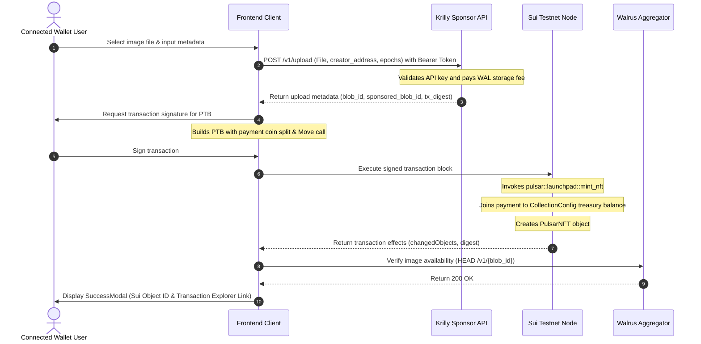

# System Architecture: PULSAR NFT Launchpad

This document describes the architectural layout, system components, data flows, and design decisions of the **PULSAR NFT Launchpad**.

---

## 1. System Overview

PULSAR is a decentralized NFT launchpad deployed on the Sui Testnet, utilizing Walrus decentralized storage for hosting digital assets (cosmic neutron star artwork). It provides a gas-less, zero-WAL-overhead image storage experience by leveraging the **Krilly Walrus Sponsor SDK** to pay for storage fees on behalf of users.

The minting process operates in a two-stage sequential pipeline:
1. **Upload Stage (Off-chain):** The user selects a digital asset and uploads it to Walrus via the Krilly Sponsor API using an authorized developer key. Krilly sponsors the storage reservation and returns content-addressed identifiers (`blob_id` and `sponsored_blob_id`).
2. **Mint Stage (On-chain):** The frontend constructs a Programmable Transaction Block (PTB) using the `@mysten/sui` and `@mysten/dapp-kit` libraries. The user signs the transaction block, which transfers SUI payment to the contract's shared `CollectionConfig` object and creates a unique `PulsarNFT` object owned by the minter.

---

## 2. Directory Structure

```
/home/ebendttl/PULSAR
├── ARCHITECTURE.md                  # This document
├── LICENSE                          # MIT License
├── README.md                        # Quick start guide
├── memory.md                        # Persistent state ledger and developer log
├── publish_output.txt               # Raw smart contract deployment logs
├── move/                            # Sui Move Smart Contracts
│   ├── Move.toml                    # Package manifest defining dependencies & addresses
│   ├── Move.lock                    # Dependency lockfile
│   └── sources/
│       └── launchpad.move           # Core launchpad contract module
└── frontend/                        # Web Client Application
    ├── package.json                 # Frontend dependencies and build configurations
    ├── tsconfig.json                # TypeScript compiler config
    ├── vite.config.ts               # Vite bundler config [NEEDS INPUT: not viewed, assumed present]
    ├── index.html                   # HTML entrypoint loading Orbitron, Syne, and Inter fonts
    └── src/
        ├── App.tsx                  # Root layout, router-equivalent view, and error boundaries
        ├── main.tsx                 # Web entry point rendering App with Sui providers
        ├── config.ts                # Configuration constants (package IDs, API URLs)
        ├── dapp-kit.ts              # Sui JsonRpcClient initialization
        ├── walrus.ts                # Krilly Walrus Sponsor REST API wrapper
        ├── vite-env.d.ts            # Vite client type definitions
        ├── styles/
        │   └── globals.css          # Premium Obsidian/Slate theme styles
        ├── hooks/
        │   ├── useCollection.ts     # Hook to fetch shared CollectionConfig state
        │   └── useMintNFT.ts        # Hook to execute Walrus upload and Sui transaction blocks
        └── components/
            ├── Header.tsx           # Global site navigation and wallet connect triggers
            ├── CollectionBanner.tsx # Dynamic collection state metrics (price, status, supply)
            ├── MintCard.tsx         # Stateful layout managing steps
            ├── UploadStep.tsx       # File upload interface and form validation
            ├── MintStep.tsx         # Transaction status, receipt preview, and trigger button
            └── SuccessModal.tsx     # Successful mint celebration with explorer links
```

---

## 3. Data Flow

The diagram below details the data flow from file selection to transaction finality on the Sui blockchain.



---

## 4. Key Design Decisions & Tradeoffs

### 4.1. Upload-to-Walrus-First Pipeline
* **Decision:** The asset must be fully uploaded and locked on the decentralized storage network before the blockchain transaction begins.
* **Tradeoff:** If the user cancels the process after the upload completes but before initiating the mint transaction, or if the blockchain transaction fails, the sponsored storage space remains occupied on Walrus. However, this is preferred over the reverse, since storing file identifiers requires an immutable content address (`blob_id`) to be present during Move contract execution.

### 4.2. Shared Object Configuration (`CollectionConfig`)
* **Decision:** Global metadata, price parameters, and current supplies are stored inside a single shared `CollectionConfig` object rather than inside contract storage or package metadata.
* **Tradeoff:** Shared objects require consensus sequencing on Sui, which adds a minimal latency overhead compared to immutable reads. However, this allows administrative wallets holding the `AdminCap` to adjust the price or pause the contract on the fly, which would be impossible with immutable package structures.

### 4.3. Client Standard Alignment (Sui 2.0+)
* **Decision:** Frontend uses `SuiJsonRpcClient` from `@mysten/sui/jsonRpc` and queries transaction changes via `changedObjects` rather than the deprecated `effects.created` property.
* **Tradeoff:** Modernizes the codebase to prevent build failures on newer version releases of `@mysten/sui` (v2.x), though it deprecates compatibility with older packages using outdated indexers.

---

## 5. Architectural Safeguards (Do Not Change Without Team Review)

The following design features are critical for system operation:

* **Sponsor API Authentication (`walrus.ts`):** The authorization header must include the `Bearer` prefix and verify that keys start with `sbk_live_`. Modifying this validation pattern will cause silent endpoint failures.
* **Creator Address Binding:** The upload POST request to Krilly *must* append the user's `creator_address`. Omitting this field will result in a `402 (Payment Required)` or parameter mismatch error from the Krilly sponsor nodes.
* **Transaction Output Parsing (`MintStep.tsx` & `useMintNFT.ts`):** The logic extracts the newly created object ID by searching for `idOperation === "Created"` within `effects.changedObjects`. Avoid using deprecated `.created` arrays as they do not exist in standard `@mysten/sui` v2+ types.
* **No Inline Gradients or Glows:** All layout styling and surface tokens must reference CSS variables defined in `globals.css` (e.g., `var(--bg-primary)`, `var(--border)`). Avoid introducing inline styles or raw color codes that break the dark "Obsidian/Slate" aesthetic framework.
